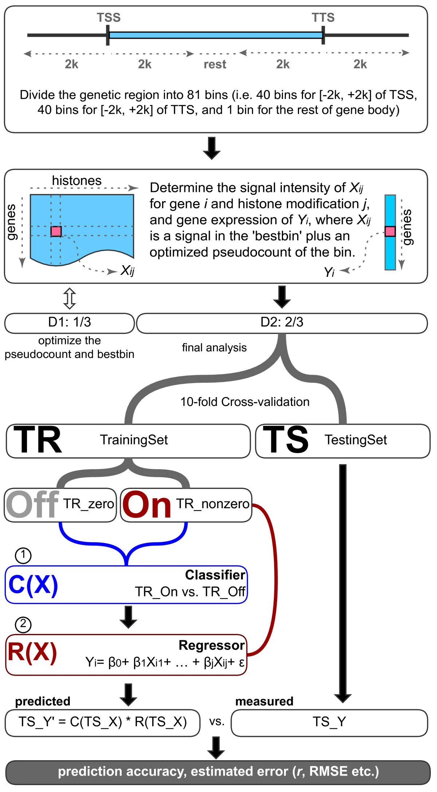

# 1. Predicting Gene Expression from Chromatin Features

This repository provides a **reproducible R pipeline** to predict **gene expression** from **chromatin features** (histone / DNase bigWigs) using a **two-step model**:
1) **classify** genes as **ON/OFF**, and  
2) **regress** log2 expression for the genes predicted ON.

It began as a GM12878-only analysis and has been **revised and generalized** so you can select **any supported cell line** by choosing the appropriate **CAGE** track and **predictor** bigWigs.

- Code: `R/`, `scripts/`  
- Configuration: `conf/`  
- Static example (PDF + figures): `reports/GM12878_two_step/`

## 2. How it works (overview)

Reproduced from: Dong X, Greven MC, Kundaje A, *et al.* (2012) *Genome Biology* 13:R53. 
Original figure: https://genomebiology.biomedcentral.com/articles/10.1186/gb-2012-13-9-r53/figures/1. 
Licensed under CC BY 2.0 (https://creativecommons.org/licenses/by/2.0/). Changes: none.

- **TSS & expression proxy** → derive 1-bp TSS from a GENCODE GTF; compute **CAGE RPM** in a ±window; keep the **max-CAGE** TSS per gene.  
- **Binning** → build strand-aware bins around each selected TSS.  
- **Best-bin features** → split genes (D1/D2); on D1, for each track pick the bin maximizing |correlation| with expression using `log2(signal + 0.1)`; on D2, extract those bins as features.  
- **Models** → logistic / random-forest / SVM for classification; LASSO / random-forest / MARS / SVM for regression (ON genes only).  
- **Evaluation** → 10-fold CV with AUC, misclassification, RMSE, and Pearson’s *r*.  
- **Importance** → multi-seed RF variable importance (classification & regression).

*Data are not shipped; you select them from public directories at run time.*

## 3. Quickstart — Step 1: Clone the repository
### Replace <YOU>/<REPO> with your GitHub path.

git clone https://github.com/<YOU>/<REPO>.git
cd <REPO>

## 3. Quickstart — Step 2: Pin the environment (renv)
### Non-interactive consent + bootstrap: creates renv.lock and activation files.

Rscript -e 'renv::consent(TRUE); source("scripts/00_bootstrap_env.R")'

## 3. Quickstart — Step 3: Choose datasets (edit conf/dataspec.yml)
### Pick your GTF (e.g., GENCODE v19), CAGE bigWig (cell line), and predictor bigWigs (marks).

### Open in Notepad (Windows):
notepad conf/dataspec.yml

### Or open in VS Code (if installed):
code conf/dataspec.yml

## 3. Quickstart — Step 4: Discover, download, and wire paths
### Populates data/raw/ and auto-writes conf/paths.yml for the orchestrator.

Rscript scripts/discover_and_download.R

## 3. Quickstart — Step 5: Run the pipeline
### Produces cached outputs in data/processed/ (not versioned).

Rscript scripts/run_all.R --paths conf/paths.yml --params conf/params.yml

## 4. Data sources (picked at run time)

- **CAGE (UCSC RIKEN CAGE)** → per-cell-line plus-strand bigWigs.  
- **Predictors (ENCODE integration bigWigs)** → histone / DNase tracks by cell line.  
- **GTF (GENCODE)** → e.g., GENCODE v19 for hg19.

Select exact files through `conf/dataspec.yml`; the downloader resolves patterns → URLs and saves them under `data/raw/`.

## 5. Troubleshooting

- **Windows parallel errors** → lower `num_workers` in `conf/params.yml`.  
- **Chromosome naming** (e.g., `chr1` vs `1`) → ensure consistency across bigWigs and GTF.  
- **Large downloads** → start with a small subset of marks.  
- **Already tracked data** → stop tracking while keeping files locally:
git rm -r --cached data/raw data/processed
git commit -m "Stop tracking data; use .gitignore"

## 6. License, Attribution & References

**License & attribution**  
- **Code**: MIT (see `LICENSE`).  
- **Third-party figures**: retain original licenses. The GM12878 methods diagram reproduced from **Dong et al. (2012)** is included under **CC BY 2.0**; see `reports/GM12878_two_step/CREDITS.md`.

**References**
- Dong, X., Greven, M.C., Kundaje, A., *et al.* (2012). **Modeling gene expression using chromatin features in various cellular contexts.** *Genome Biology*, 13:R53. https://doi.org/10.1186/gb-2012-13-9-r53  
- R Core Team (2012). **R: A language and environment for statistical computing.** R Foundation for Statistical Computing, Vienna, Austria. http://www.R-project.org/  
- Frankish, A., Diekhans, M., Ferreira, A.M., *et al.* (2019). **GENCODE reference annotation for the human and mouse genomes.** *Nucleic Acids Research*, 47(D1):D766–D773. https://doi.org/10.1093/nar/gky955  
- The ENCODE Project Consortium (2012). **An integrated encyclopedia of DNA elements in the human genome.** *Nature*, 489:57–74. https://doi.org/10.1038/nature11247  
- Koch, C.M., Andrews, R.M., Flicek, P., *et al.* (2007). **The landscape of histone modifications across the human genome.** *Genome Research*, 17(6):691–707. https://doi.org/10.1101/gr.5704207
